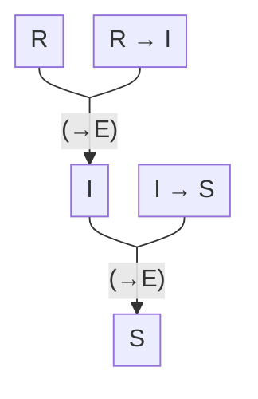
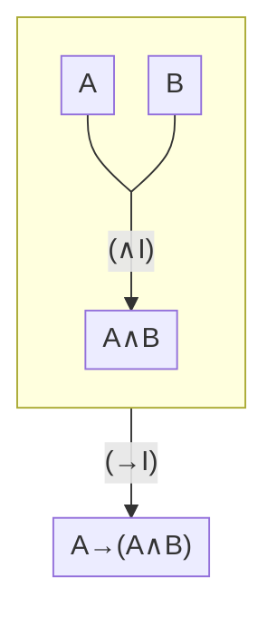
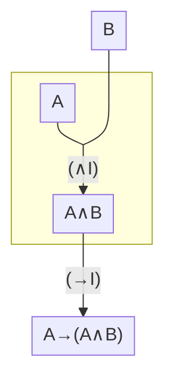

<h1 align="center">
<br>
Educational Proof Assistant
</h1>

<p align="center">
	
	<a href="/LICENSE.txt"></a>
	
	
</p>

Twig aims to provide learners with a means to *interact with formal mathematics without needing to have studied logic beforehand*; to support a *learning-through-interaction* approach to teaching natural deduction. Derivations are represented in an intuitive, tree-shaped form (Gentzen-style) and continuously verified.

> [!NOTE]
> This project is currently at a very early stage and it is still missing some important features, such as Undo/Redo. See [upcoming features](#upcoming-features).

---

<details open><summary><h2 style="display:inline-block">Table of Contents</h2></summary>

- [How to Use](#how-to-use)
	- [(1/2) UI Tutorial](#12-ui-tutorial)
	- [(2/2) The Mathematics](#22-the-mathematics)
		- [The Language](#the-language)
		- [The Deductive System](#the-deductive-system)
		- [Rule List](#rule-list)
		- [Downsides to Gentzen Notation](#downsides-to-gentzen-notation)
- [Upcoming Features](#upcoming-features)
- [Running Locally](#running-locally)
	- [Troubleshooting](#troubleshooting)
- [License](#license)
	- [Third-Party Assets](#third-party-assets)

</details>

## How to Use

This section is divided into two parts: [a quick UI walkthrough](#12-ui-tutorial), and [an intro to logic](#22-the-mathematics).

### (1/2) UI Tutorial

Let's go through the steps to make a simple derivation while exploring the current primary features.

1. Double-click the viewport to create a blank formula field.
   
    

2. Type `A.andB` (case-sensitive) into the formula field.
   
	

	Notice that;
	- `.and` automatically turns into `∧`. See [the language specification](#the-language) for other special symbol codes.
	- The field changes color as you type, based on whether it contains a valid formula or not.
	- A vertical bar and the text `(Ax)` appear on top of it. This means that the formula `A∧B` is derived from *"Axiom Rule" (Ax)*. What you have created is not just a formula, but also a trivial derivation using it. The derivation states that `A∧B` is a consequence of `A∧B`, or `{ A∧B } ⊢ A∧B` for short. The viewport always contains derivations (or invalid derivations), never bare formulas. The rule `(Ax)` automatically hides itself when `A∧B` is deselected and not hovered.
	- Press `Esc` twice, or click outside the derivation to deselect.
  
3. Create another blank derivation and type just `A` in it. Now carry this derivation using the handles on it's side (these will become visible once you hover over it). Carry `A` above the bar of `A∧B`, drop it once the line connecting them becomes visible.
   
	

	- Here we have an invalid derivation, so the *rule* shows up as `(-)` and has a red background that signals that there's an error.

4. Click the dot at the right side of `A` (called an *adder*) to add another formula (thus another derivation), and type `B` in it.
   
	

   - These two steps demonstrated different ways to expand a derivation.
   - Now you should have a valid derivation that demonstrates `{ A, B } ⊢ A∧B`. No parts of the derivation should appear red at this point.

5. Using the adder (dot) at the bottom of `A∧B`, add `A→A∧B` by typing `A.impA.andB`.
   
	

	- Now a *label* `1` should appear at the left side of the new *"→ Introduction Rule" (→I)*. The rule of `A` also appears to change from the hidden `(Ax)` rule to the new label `1`. Here the actual rule of `A` is still `(Ax)`, but `A` is *discharged by the step labelled `1`*.
	- Our final derivation has the *(undischarged) assumption* `B` and the conclusion `A→A∧B`. Hence it's a proof of `{ B } ⊢ A→A∧B` ("`A→A∧B` is a consequence of `B`."). Think of `A` here as a temporary assumption.

6. In addition to the features presented, you should also try;
   - Select `A→A∧B` by clicking on its handle. Then do `Ctrl` `V` and `Ctrl` `C` to duplicate it. Use the `Delete` key to delete the duplicate.
  
		

   - Bars of derivations can be selected separately from formulas, this interacts differently with the Copy/Paste and Delete features.
  
		

   - We've seen dragging a derivation with it's handle, but you can also drag the bar. Drag the bar on top of `A∧B` to remove its children. This will make a duplicate of `A∧B`, you can drag it back into place by dragging the bar again. the formula of the duplicate is faded out, this signals that you can drag its bar without duplicating the formula. If you want a faded out formula to become a normal one, just click on it.
  
		

Currently the way to use Twig, is to write down all the formulas and connect them in to a tree shaped structure, what rules are used between them is automatically inferred. The rule-driven derivation interface feature will add a better way to add formulas when it's added. It will also allow for choosing the rule in cases where multiple rules apply, i.e. rule collisions.

### (2/2) The Mathematics

#### The Language

The *atomic formulas* are any combination of letters and numbers starting with a capital letter (except the special atomic formulas `⊤` and `⊥`). These are combined with the *connectors* in the precedence table below, or used by themselves to make all the *formulas* of our language.

|Prec.|Name       |Symbols|Arity|Assoc.|Pattern        |Codes           |
|-----|-----------|-------|-----|------|---------------|----------------|
|7    |Parentheses|`()`   |1    |-     |`(…((ϕ))…)`    |                |
|6    |Not        |`¬`    |1    |-     |`¬…¬¬ϕ`        |`.not`          |
|5    |And        |`∧`    |2    |Left  |`ϕ∧β∧…∧ε`      |`.and` `.^` `.&`|
|4    |Or         |`∨`    |2    |Left  |`ϕ∨β∨…∨ε`      |`.or` `.v`      |
|3    |Implies    |`→`    |2    |Right |`ϕ→β→…→ε`      |`.imp` `->`     |
|2    |If         |`←`    |2    |Left  |`ϕ←β←…←ε`      |`.if` `<-`      |
|1    |Iff        |`↔`    |2    |Left  |`ϕ↔β↔…↔ε`      |`←f` `<->`      |

- To demonstrate the difference between left-associative and right-associative operations;
  - `A∧B∧C∧D` is interpreted as `((A∧B)∧C)∧D` (left-assoc.),
  - `A→B→C→D` is interpreted as `A→(B→(C→D))` (right-assoc.).
- You can write the expressions in the **Codes** column into the formula fields in Twig to produce the corresponding symbol, e.g. write `.not` to get `¬`.
- There are also codes for the special atomic formulas:
  - `⊤`: `.true` `.top`
  - `⊥`: `.false` `.bottom` `.absurdity`
- The connector `←` is only a convenience feature. Instances of `ϕ←β` in formulas are effectively turned into `β→ϕ` because they are parsed into the same syntax tree. They can be used interchangeably.

> [!IMPORTANT]
> You may know that the connectors `∧`("and") and `∨`("or") are commutative and associative, so for example: `(A∧B)∧C` is equivalent, in a sense, to `A∧(B∧C)` and `B∧(A∧C)` (as in, each can be proved from any other), but that doesn't mean they are *equal*, so you can't use them interchangably. You have to actually prove that they are equivalent whenever you need that information. On the other hand, `A∧B∧C`, `(A∧B)∧C` and `(((A∧B))∧(C))` are treated as if they are the exact same formula always, because they are parsed to the same syntax tree.

The language is defined using something called a *parsing expression grammar* (PEG). If you already know about PEGs, you can optionally check out the details below:

<details><summary>PEG Details</summary>

##### The Parsing Expression Grammar <!-- omit in toc -->

A version (written in [Peggy](https://peggyjs.org/)) without whitespaces would look like:

```peggy
Formula = LeftImplication ("↔" LeftImplication)*

LeftImplication = Implication ("←" Implication)*

Implication = Disjunction ("→" Implication)?

Disjunction = Conjunction ("∨" Conjunction)*

Conjunction = Primary ("∧" Primary)*

Primary = "(" Formula ")" / "¬" Primary / Atom

Atom = [A-Z] [a-zA-Z0-9]* / [⊤⊥]
```

It doesn't show up here clearly that all binary connectors except `→` are left-associtative, since that's partially handled by the JavaScript code that's omitted. Although notice that `Implication` is defined recursively while the other binary operators aren't, i.e. it uses itself in its definition. Also it uses `?` instead of `*`.

A natural thing to try for defining a left-associative operator is:
```peggy
Disjunction = (Disjunction "∨")? Conjunction
```
But this *left-recursion* pattern causes infinite loops by our kind of parser. So instead they are treated as an operator that takes an arbitrary number of operands, and the parsed chain is turned into the left-recursive tree afterwards…


In the full version used by the application, whitespaces are added under the name `_`. The whitespace definition also takes into account the non-breaking whitespace `\xC2\xA0`, tab `\t`, newline `\n` and carriage return `\r`.

```peggy
Formula = _ LeftImplication (_ "↔" _ LeftImplication)* _

LeftImplication = Implication (_ "←" _ Implication)*

Implication = Disjunction (_ "→" _ Implication)?

Disjunction = Conjunction (_ "∨" _ Conjunction)*

Conjunction = Primary (_ "∧" _ Primary)*

Primary = "(" Formula ")" / "¬" _ Primary / Atom

Atom = [A-Z] [a-zA-Z0-9]* / [⊤⊥]

_ = [ \xC2\xA0\t\n\r]*
```

For more information, check-out [Peggy](https://peggyjs.org/) (see [Grammar Syntax and Semantics](https://peggyjs.org/documentation.html#grammar-syntax-and-semantics) and [Parsing Expression Types](https://peggyjs.org/documentation.html#grammar-syntax-and-semantics-parsing-expression-types) in its documentation in particular), [the PEG Wikipedia article](https://en.wikipedia.org/wiki/Parsing_expression_grammar) and [the actual Peggy file used in Twig](/src/lib/state/logic/grammar/grammar.pegjs), which includes some JavaScript code not shown here.

</details>

#### The Deductive System

We can deduce;

- I'm going to <ins>**s**</ins>leep. (Abbreviate `S`)

from the premises;

- If it's <ins>**r**</ins>aining, I'll stay <ins>**i**</ins>nside. (Abbrv. `R→I`)
- If I'll stay <ins>**i**</ins>nside, I'm going to <ins>**s**</ins>leep. (Abbrv. `I→S`)
- It's <ins>**r**</ins>aining. (Abbrv. `R`)

We can informally present such a deduction like this:


Here `(→E)` is another name for Modus Ponens, it's short for "`→` Elimination". Twig uses a similar notation:

<div align="center"></div>

Arrows are replaced by horizontal bars. This is sometimes called Gentzen notation.

Now let's consider another case. Given `A` and `B` are some sentences, assuming `B` would be enough to deduce `A→(A∧B)`, regardless of whether `A` is true or not. The following diagram may carry the idea across.

Assume `B`, then temporarily assume `A`. Then `A∧B`. Since temporarily assuming `A` gave us `A∧B`, `A` implies `A∧B`, notated `A→(A∧B)`. Here you can think `(→I)` as taking a derivation, rather than a formula as its input; a proof of `A∧B` assuming `A`. This sub-derivation is shown as a box containing `A`, `B` and `A∧B`.

This diagram doesn't explicitly show the difference between temporary assumptions and non-temporary ones. In order to do so, we can use the box slightly differently. Instead of having it represent a derivation, let's try having it represent an *environment* where we are allowed to assume `A`:



Here `(→I)` takes the formula `A∧B` instead of a derivation with conclusion `A∧B`, but you're free to use `A` above `(→I)`. Formulas that depend on `A`, such as `A∧B`, are drawn inside the box. We can think of the `(→I)` rule here as the step that allows us to *discharge* `A`. Now finally we`re ready to see how this looks Gentzen-style!

<div align="center"></div>

`A` is indicated to be discharged by the step labelled `1` which is the `(→I)` step. Note that the rule of `A` did not change! It's still deduced by axiom rule `(Ax)` just like `B`. (This rule is usually hidden in Twig.)

Now you're ready for the actual introduction.

##### First Steps Towards Formalization <!-- omit in toc -->

*Derivation* is defined inductively/recursively. Each derivation has a *conclusion* and *assumptions*, these are also defined inductively. For clarification, you can think of the definition of;
- **derivation**, as answering the question "Is this diagram a derivation?" for each diagram in a pre-determined space of diagrams. So it can be formalized as a subset of that space.
- **conclusion**, as defining a function from the set of all derivation to the set of all formulas. This answers "What formula is the conclusion of this derivation?".
- **assumption**, as defining a function from the set of all derivations to the *set of all sets of formulas*. It answers "What formulas are the assumptions of this derivation?".

Each clause of the definition of derivation (along with corresponding clauses for conclusion and assumptions) will be referred to as a *rule*. 

> [!IMPORTANT]
> These descriptions aren't completely accurate as there's one simplification: Instead of using formulas, we are actually using their syntax trees in conclusion and assumptions. So for example, if a derivation appears to have the assumptions `A∧B∧C`, `(A∧B)∧C`, `(((A∧B))∧(C))`, `A∧(B∧C)` and `B∧(A∧C)`; it actually has only three assumptions because the first three formulas have the same syntax tree. We'll pretend that we are still using formulas themselves instead of their trees, but this pretend-speak is only meant as an abbreviation!

<details><summary><strong>Optional technical notes</strong></summary>

- We won't be very formal here; considering that these definition should hold up on their own in plain English, i.e. not relying on any formal mathematical system like set theory. Those formal systems are themselves deductive systems like these. So consider the reference to "sets" as just referencing the regular, informal idea of a collection; apply the same treatment to functions, etc… 

- Notice that we are also taking for granted the idea that we can draw diagrams, talk about a space of all diagrams and many similar ambiguous tasks. We leave it upto the reader to fill-in these philosophical gaps, or die trying.

</details>

Let's look at some rules before we present the full list of rules.

> **Axiom Rule `(Ax)`**
>
> Each formula is a derivation. The conclusion and only assumption of this derivation is the formula itself.

You may call this a base case of the induction. If you're not familiar with induction it might look weird, but it makes sense right? Either way, moving on.

> **∧ Introduction Rule `(∧I)`**
>
> For all derivations D and E with formulas `ϕ` and `β` respectively; 
> - writing them next to each other (such that D is on the left and their bottoms align),
> - drawing a horizontal bar immediately under them,
> - writing `(∧I)` immediately to the right of the bar,
> - writing `ϕ∧β` (or a formula with the same syntax tree) immediately under the bar,
>
> produces a derivation with the conclusion `ϕ∧β`. Its assumptions are the assumptions of D and E together. (Recall set union.)

(Again don't forget that the conclusion and assumptions are actually syntax trees, so formulas with same trees are interchangable everywhere. We won't bug you with any more of these reminders.)

Most rules look like this. 

From now on, we'll use the word *node* to mean a formula and the bar immediately over it together with its right and left annotations (the rule name and label), if there is a bar at all; otherwise the formula by itself is the node. 

Because rules have a lot in common, there's a lot to shave of for a more compact representation of the rule definition, which carries us to the next chapter.

##### Sequents & Shorthand <!-- omit in toc -->

Consider this derivation.

<div align="center"></div>

Carefully reading the definitions of `(Ax)` and `(∧I)`, you would deduce:
- It's conclusion is `(A∧B)∧(C∧D)`.
- It's assumptions are `A`, `B`, `C` and `D`.

In this case we say that:
> There's a derivation *of* `(A∧B)∧(C∧D)` *from* `A`, `B`, `C` and `D`.

Or equivalently:
> `(A∧B)∧(C∧D)` *is derivable from* `A`, `B`, `C` and `D`.

This sentence is shortened with the notation:
> `{ A, B, C, D } ⊢ (A∧B)∧(C∧D)`

This sentence is called a *sequent*. Furthermore, we say that the derivation is a *proof of* the sequent. Basically we prefer to use the words derivation and proof differently: Derivation is the primary word. Proof is used when talking about sequents. They interact differently with the prepositions "from" and "of". Don't worry about it too much.

When there are no assumptions, we'll write just `⊢ A` instead `∅ ⊢ A`.

> [!IMPORTANT]
> We are actually use the sentence `Γ ⊢ ϕ` to mean "There is a proof of `ϕ` with the assumption set `Γ` *or some subset of it*." So `Γ ⊢ ϕ` implies `Γ ∪ Δ ⊢ ϕ` for any `Δ`. So for example `{ A, B, C, D, E, F, G, H∧I } ⊢ (A∧B)∧(C∧D)` is also true because `{ A, B, C, D } ⊢ (A∧B)∧(C∧D)` is true.

Now we can rewrite `(Ax)` a bit shorter:
> **∧ Introduction Rule `(∧I)`**
>
> (For all formula syntax tree sets `Γ`, `Δ` and formulas `ϕ`, `β`)
>
> Given some proofs of `Γ ⊢ ϕ` and `Δ ⊢ β`, you can make a proof of `Γ ∪ Δ ⊢ ϕ∧β`.
>
> (By writing them next to each other bottom-alinged and in-order, slapping on the bar and rule name `(∧I)` under them, and finally a syntax tree equivalent of `ϕ∧β` under that.)

Further shorten it to:

```
Γ ⊢ ϕ
Δ ⊢ β
∴ Γ ∪ Δ ⊢ ϕ∧β
```

And further:

```
⊢ ϕ
⊢ β
∴ ⊢ ϕ∧β
```

The assumption sets (in this case `Γ` and `Δ`) are unioned. This is the same for all the rules except for the cases where an assumption gets dischaged. `⊢` isn't shortened away as it will be useful in those special cases. For now we're done with our shortening spree and can start discussing those cases right away.

##### Discharging <!-- omit in toc -->

Let's examine the simplest discharging rule.

> **→ Introduction Rule `(→I)`**
>
> (For all formula syntax tree set `Γ` and formulas `ϕ`, `β`)
>
> Given some proof of `Γ ⊢ ϕ`, you can make a proof of `Γ / { β } ⊢ β→ϕ`.
>
> (By doing the usual shtick of writing them together with the bar, rule name and `ϕ∧β`…)
>
> Draw a bar on top of all instances of `β` in the derivation without a bar on top. Label the right sides of these bars and the left side of the new `(→I)` bar with the same number. The label should look like the number with a circle or round shape around it. This is called *discharging*. This number should be different from any pre-existing labels. Additionally if you encounter an instance of `β` that's already discharged, you can leave it as is or change its label to the new one. (Twig chooses to leave them.)

Discharged instances of formulas are still considered to have the rule `(Ax)` even though its never written explicitly.

By this point you might have realised that our assumptions have been formulas of the leaf nodes, i.e. formulas that don't have a bar or any formulas drawn immediately above them.  Since `β` can be in the original derivation as assumption nodes (undischarged nodes with rule `(Ax)`), but its not an assumption of the final derivation (proof of `Γ / { β } ⊢ β→ϕ`) we cover its top with a bar. *This way we can say that the assumptions of a derivation come from its formulas without a bar over them (which are always situated in leaf nodes by the way), and the conclusion comes from its root node (the lowest node in the diagram).*

In alternative definitions of Gentzen-style proofs, drawing which assumption nodes are discharged are sometimes considered a non-essential, cosmetic part of the proof diagram. Even if the discharging marks are omitted, they can be deduced later by analyzing the proof…

You may shorten the definition of `(→I)` like:
```
Γ ⊢ ϕ
∴ Γ / { β } ⊢ β→ϕ
```

But we'll use a slightly round-about approach. To understand this, see this more complicated rule:

> **∨ Elimination Rule `(∨E)`**
>
> Given some proofs of `Γ ⊢ ϕ∨β`, `Δ ⊢ ε` and `Θ ⊢ ε`, you can make a proof of `Γ ∪ (Δ / { ϕ }) ∪ (Θ / { β }) ⊢ ε`.
>
> See that `ϕ` is only discharged from the branch of our final derivation that comes from the proof of `Δ ⊢ ε` (because it's excluded from just `Δ`, not the whole union `Γ ∪ Δ ∪ Θ`). And similarly `β` is only discharged from the branch of `Θ ⊢ ε`.

This means that if `Γ` has `ϕ` for example, our final derivation will still have `ϕ` as an (undischarged) assumption; we won't have been able to effectively discharge it out of our proof.

We would attempt to start shortening this like:
```
Γ ⊢ ϕ∨β
Δ ⊢ ε
Θ ⊢ ε
∴ Γ ∪ (Δ / { ϕ }) ∪ (Θ / { β }) ⊢ ε
```
But there's a better way. We can restate this as the following, even though it may not be obvious why we can do so.
```
Γ ⊢ ϕ∨β
Δ ∪ { ϕ } ⊢ ε
Θ ∪ { β } ⊢ ε
∴ Γ ∪ Δ ∪ Θ ⊢ ε
```
Let's leave it as an exercise to figure out why this implies the same rule even when you don't assume that `ϕ ∉ Δ` and `ε ∉ Θ`.

Now finally omitting `Γ`, `Δ` and `Θ`, and the curly braces `{}`, we use the following to represent `(∨E)`:
```
⊢ ϕ∨β
ϕ ⊢ ε
β ⊢ ε
∴ ⊢ ε
```
"If you know `ϕ∨β`, and you can prove `ε` in both cases (`ϕ` and `β`), then `ε` is true."

And here's what `(→I)` becomes:
```
β ⊢ ϕ
∴ ⊢ β→ϕ
```

Finally you are ready to see the full list of rules. Note that some rules are presented with two lines prefixed `∴`, this means it allows you deduce two conclusions (but you still pick one; if you want both, duplicate the derivation with copy/paste). For an example check out `(∧E)`.

#### Rule List

> [!NOTE]
> In case of a rule collision (when two rules can apply for given assumptions and conclusion of a single step), what rule applies is based on rule priority. All you need to know is, discharging rules have higher priority and `(¬I)` has priority over `(¬E)`. At this time, you can't choose to switch to a lower priority rule. This capability will be added later as a part of the rule-driven derivation interface feature.


##### Axioms <!-- omit in toc -->

<table>
	<thead>
		<tr>
			<th> Long Name </th> <th> Name </th> <th> Rule Specification </th>
		</tr>
	</thead>
	<tbody> <!------------------------------------>
		<tr>
			<td> Axiom </td>
			<td> <code>(Ax)</code> </td>
			<td>
<pre><code>∴ ϕ ⊢ ϕ</code></pre>
			</td>
		</tr> <!------------------------------------>
		<tr>
			<td> <code>⊤</code> Introduction </td>
			<td> <code>(⊤I)</code> </td>
			<td>
<pre><code>∴ ⊢ ⊤</code></pre>
			</td>
		</tr> <!------------------------------------>
		<tr>
			<td> <code>⊥</code> Introduction </td>
			<td> <code>(⊥I)</code> </td>
			<td>
<pre><code>∴ ⊢ ¬⊥</code></pre>
			</td>
		</tr> <!------------------------------------>
	</tbody>
</table>

##### Rules for Conjunction <!-- omit in toc -->

<table>
	<thead>
		<tr>
			<th> Long Name </th> <th> Name </th> <th> Rule Specification </th>
		</tr>
	</thead>
	<tbody> <!------------------------------------>
		<tr>
			<td> <code>∧</code> Introduction </td>
			<td> <code>(∧I)</code> </td>
			<td>
<pre><code>⊢ ϕ
⊢ β
∴ ⊢ ϕ∧β</code></pre>
			</td>
		</tr> <!------------------------------------>
		<tr>
			<td> <code>∧</code> Elimination </td>
			<td> <code>(∧E)</code> </td>
			<td>
<pre><code>⊢ ϕ∧β
∴ ⊢ ϕ
∴ ⊢ β</code></pre>
			</td>
		</tr> <!------------------------------------>
	</tbody>
</table>

##### Rules for Disjunction <!-- omit in toc -->

<table>
	<thead>
		<tr>
			<th> Long Name </th> <th> Name </th> <th> Rule Specification </th>
		</tr>
	</thead>
	<tbody> <!------------------------------------>
		<tr>
			<td> <code>∨</code> Introduction </td>
			<td> <code>(∨I)</code> </td>
			<td>
<pre><code>⊢ ϕ
∴ ⊢ ϕ∨β
∴ ⊢ β∨ϕ</code></pre>
			</td>
		</tr> <!------------------------------------>
		<tr>
			<td> <code>∨</code> Elimination </td>
			<td> <code>(∨E)</code> </td>
			<td>
<pre><code>⊢ ϕ∨β
ϕ ⊢ ε
β ⊢ ε
∴ ⊢ ε</code></pre>
			</td>
		</tr>
	</tbody>
</table>

##### Rules for Conditional <!-- omit in toc -->

<table>
	<thead>
		<tr>
			<th> Long Name </th> <th> Name </th> <th> Rule Specification </th>
		</tr>
	</thead>
	<tbody> <!------------------------------------>
		<tr>
			<td> <code>→</code> Introduction </td>
			<td> <code>(→I)</code> </td>
			<td>
<pre><code>β ⊢ ϕ
∴ ⊢ β→ϕ</code></pre>
			</td>
		</tr> <!------------------------------------>
		<tr>
			<td> <code>→</code> Elimination </td>
			<td> <code>(→E)</code> </td>
			<td>
<pre><code>⊢ ϕ
⊢ ϕ→β
∴ ⊢ β</code></pre>
			</td>
		</tr> <!------------------------------------>
	</tbody>
</table>

##### Rules for Negation <!-- omit in toc -->

<table>
	<thead>
		<tr>
			<th> Long Name </th> <th> Name </th> <th> Rule Specification </th>
		</tr>
	</thead>
	<tbody> <!------------------------------------>
		<tr>
			<td> <code>¬</code> Introduction </td>
			<td> <code>(¬I)</code> </td>
			<td>
<pre><code>β ⊢ ϕ
β ⊢ ¬ϕ
∴ ⊢ ¬β</code></pre>
			</td>
		</tr> <!------------------------------------>
		<tr>
			<td> <code>¬</code> Elimination </td>
			<td> <code>(¬E)</code> </td>
			<td>
<pre><code>¬β ⊢ ϕ
¬β ⊢ ¬ϕ
∴ ⊢ β</code></pre>
			</td>
		</tr> <!------------------------------------>
	</tbody>
</table>

##### Rules for Biconditional <!-- omit in toc -->

<table>
	<thead>
		<tr>
			<th> Long Name </th> <th> Name </th> <th> Rule Specification </th>
		</tr>
	</thead>
	<tbody> <!------------------------------------>
		<tr>
			<td> <code>↔</code> Introduction </td>
			<td> <code>(↔I)</code> </td>
			<td>
<pre><code>⊢ ϕ→β
⊢ β→ϕ
∴ ⊢ ϕ↔β</code></pre>
			</td>
		</tr> <!------------------------------------>
		<tr>
			<td> <code>↔</code> Elimination </td>
			<td> <code>(↔E)</code> </td>
			<td>
<pre><code>⊢ ϕ↔β
∴ ⊢ ϕ→β
∴ ⊢ β→ϕ</code></pre>
			</td>
		</tr> <!------------------------------------>
	</tbody>
</table>

#### Downsides to Gentzen Notation

Working with tree shaped derivations can be less practical compared to of linear ones. Twig is made to just accompany someone learning logic for a short time, not to be a tool where actual mathematical research is carried out (even in the future when more advanced logics are supported). That said, it's very easy to turn these derivations to linear ones, and this is an upcoming feature. You also have to learn very little extra to turn the understanding of this deductive system to any other; natural deduction isn't quite about specific notations anyway.

One annoying issue about Gentzen notation is that whenever you need to use some information multiple times, you have to duplicate its derivation. There's an upcoming feature called "Custom rules" that eliminates this issue.

## Upcoming Features

- Undo/Redo history
- First-order logic support and additional deductive systems<br>
  *(Twig currently supports propositional logic only.)*
- Rule-driven derivation interface<br>
  *(Adds a better, less cumbersome way to extend derivations.)*
- Fully automatic proving for propositional logic
- Info panel<br>
  *(Detects and displays useful properties of derivations.)*
- Gentzen notation to linear notation conversion
- Custom rules
- SVG and $\LaTeX$ export
- Different color themes, inluding light and high-contrast themes
- Many other quality-of-life improvements and accessibility features… 

See [Twig Project Board](https://github.com/users/canbaykar/projects/2) for more complete information on upcoming features.

## Running Locally

Install a recent LTS version of [Node.js](https://nodejs.org/) and [Git](https://git-scm.com/). You may need to restart your computer in order for these to work correctly. Then execute the following commands in a terminal to set up Twig:

```bash
git clone https://github.com/canbaykar/Twig.git
cd Twig
npm install
npm run build
```

Now you can start the server:

```bash
npm run start:open
```

And stop the server using `Ctrl` `C` while the terminal is focused. Keep the terminal window open while the app is running.

> [!TIP]
> When you want to start Twig server again after closing the original terminal window you used for setup, don't forget to navigate to the correct directory with the `cd` command beforehand. If the Twig folder created during setup has path `C:/X/Y/Z/Twig`, then execute `cd C:/X/Y/Z/Twig` to navigate into the project directory before `npm run start:open`.

### Troubleshooting

<details><summary><strong>I'm getting errors setting up.</strong></summary>

- Try restarting your terminal.
- If you're using Windows and running `npm` results in “command not found” (or a similar error), Node.js may not have been added to your PATH during installation. Reinstall Node.js and make sure any option like “Add to PATH” is enabled, then restart your computer.

</details>

<details><summary><strong>I set up the server successfully but <code>npm run start:open</code> throws an error.</strong></summary>

- If the error includes `address already in use 0.0.0.0:3000`, try running `$env:PORT=3001; npm run start` (This is for Windows PowerShell. In MacOS or Linux, run `PORT=3001 npm run start` instead.) to start the server on port 3001 instead and go to http://localhost:3001 in a browser. If you again get the same error, try 3002 and so on.

- If the error includes `Could not read package.json` instead, you may not be in the correct directory in your terminal. See the tip about the `cd` command above.

</details>

## License
The source code is licensed under [GPL-3.0](/LICENSE.txt). The Twig logo and branding are **not** covered by this license.

### Third-Party Assets

This project uses:
- [M PLUS 1](https://fonts.google.com/specimen/M+PLUS+1) as its math font.
- [National Park](https://nationalparktypeface.com/) as its logo font.

Both are licensed under the [SIL Open Font License](https://openfontlicense.org/).

See `LICENSE-3RD-PARTY.txt` for other assets.